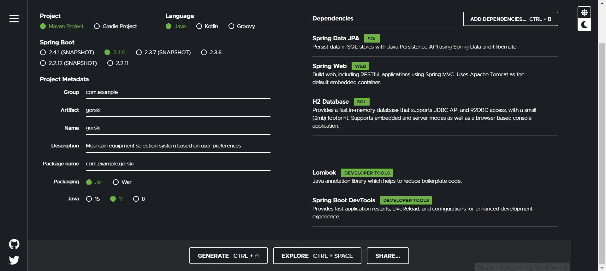
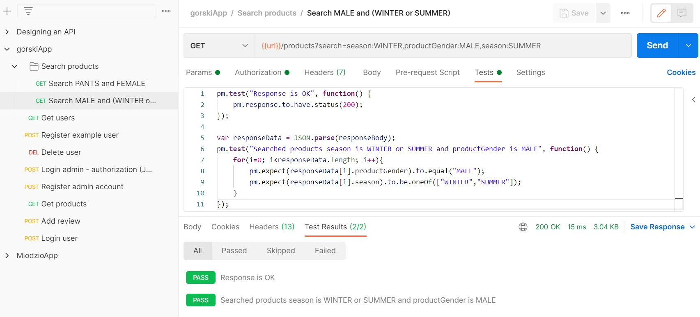
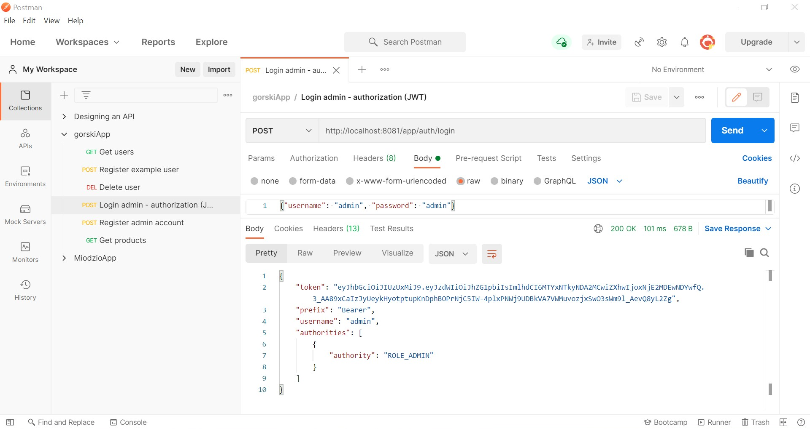
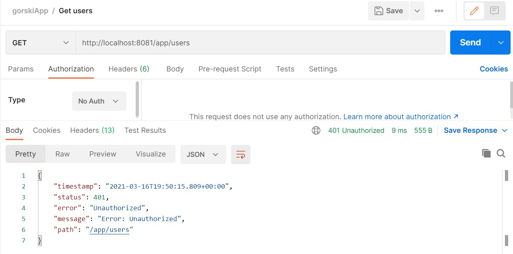
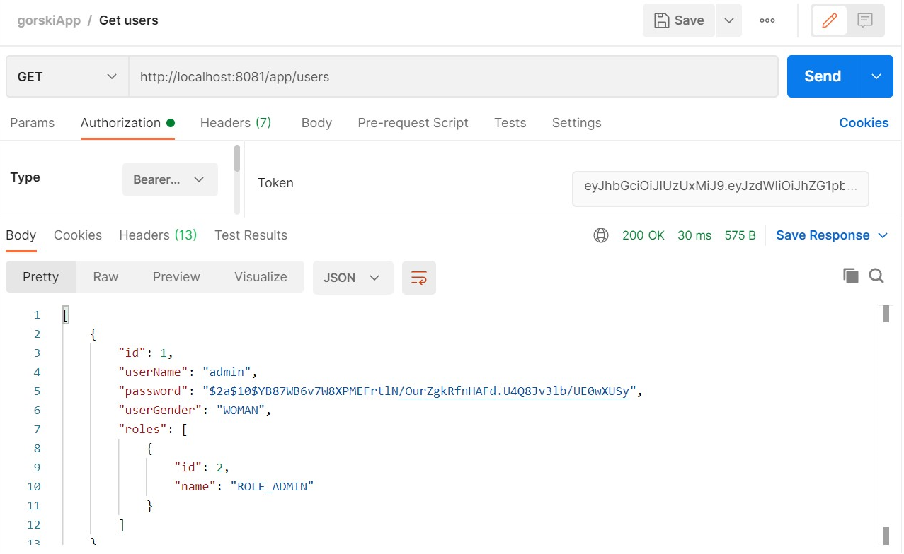
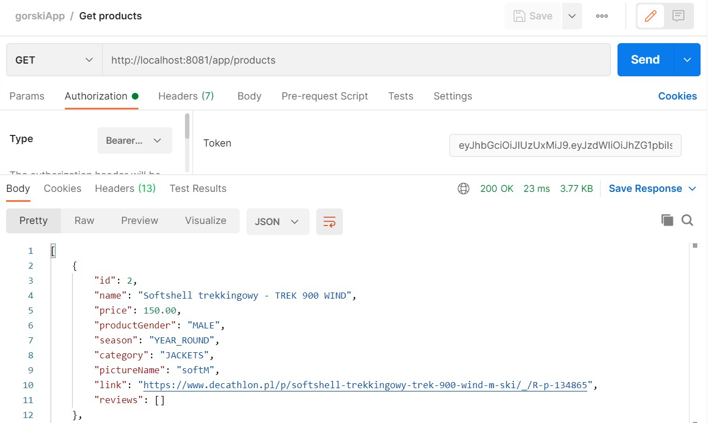

# Gorski Rest Service (in progress...)

First of all, this project is created to learn how **REST API** works, and also learn about: **JWT** authentication with **Spring Boot, Hibernate** (+ **Flyway** data migrations), Maven, **Lombok, Postman** tool.

### [gorski-ui](https://github.com/domib22/gorski-ui)

##### The project was created with Spring Initalizr:

## SETUP (with Maven):
* mvn clean install
* java -jar target\gorski-0.0.1-SNAPSHOT.jar

=-=-=-=-=-=-=-=-=-=-=-=-=-=-=-=-=-=-=-=-=-==-=-=-=-=-=

##### Example test (search products) with Postman:

##### Example HTTP requests with Postman:

